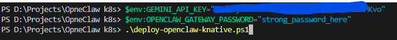
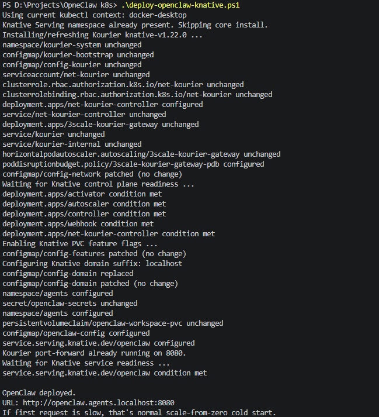
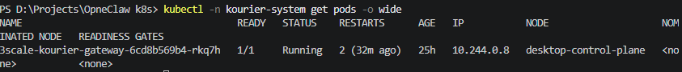
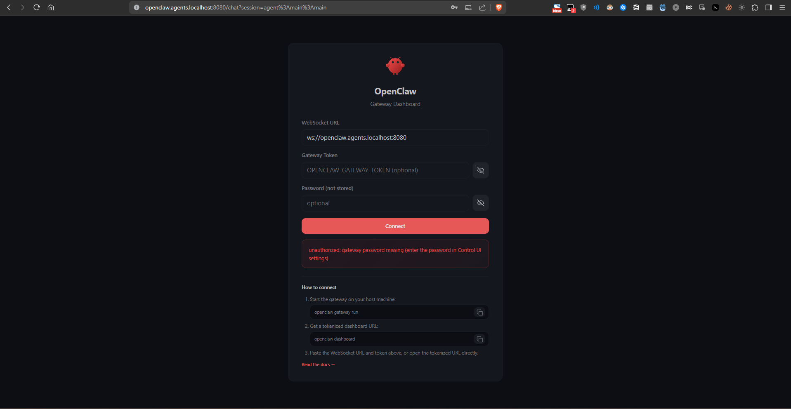
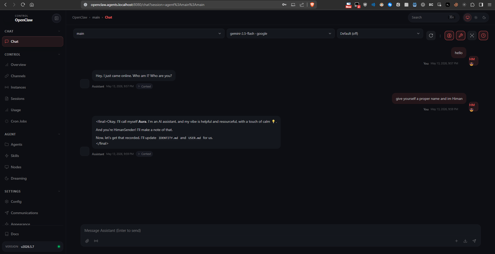
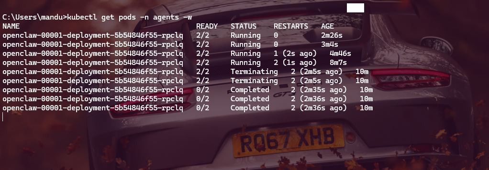
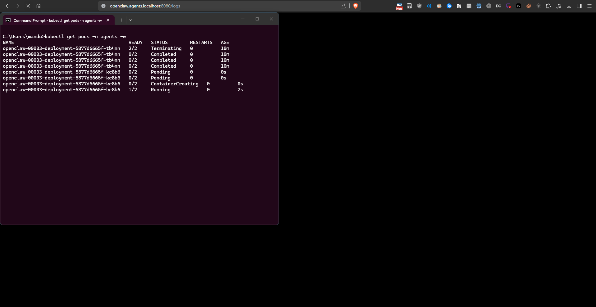
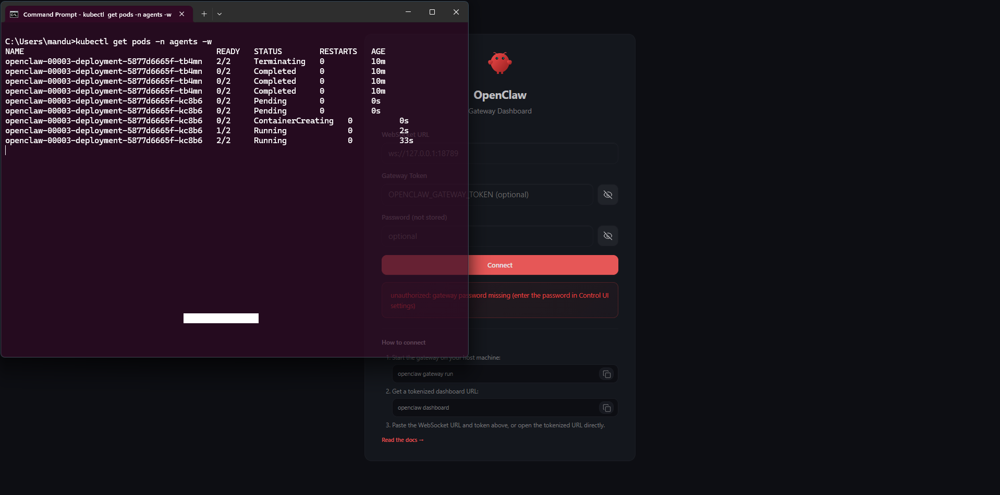

# OpenClaw on Knative (minikube/kind)

This setup runs OpenClaw Gateway on Knative with scale-to-zero and local routing that works with strict origin/auth checks.

## Files

- `k8s\openclaw-knative.yaml`: Namespace, PVC, OpenClaw config, Knative Service
- `deploy-openclaw-knative.ps1`: Windows deployment script
- `deploy-openclaw-knative.sh`: Linux/macOS deployment script

## Prerequisites

- `kubectl` installed and pointed at your cluster
- Cluster running (`minikube` or `kind`)
- Env vars set:
  - `GEMINI_API_KEY`
  - `OPENCLAW_GATEWAY_PASSWORD`

## One-command deploy (Windows)

```powershell
cd "D:\Projects\OpneClaw k8s"
$env:GEMINI_API_KEY="your_key_here"
$env:OPENCLAW_GATEWAY_PASSWORD="strong_password_here"
.\deploy-openclaw-knative.ps1
# Optional: use local port 80 instead of 8080
.\deploy-openclaw-knative.ps1 -LocalPort 80
```

## One-command deploy (Linux/macOS)

```bash
cd "/path/to/OpneClaw k8s"
export GEMINI_API_KEY="your_key_here"
export OPENCLAW_GATEWAY_PASSWORD="strong_password_here"
chmod +x ./deploy-openclaw-knative.sh
./deploy-openclaw-knative.sh
# Optional: use local port 80 instead of 8080
./deploy-openclaw-knative.sh --local-port 80
```

## Manual deployment steps

If you prefer not to use the scripts, here are the equivalent steps:

### 1. Install Knative Serving

```bash
kubectl apply -f https://github.com/knative/serving/releases/download/knative-v1.22.0/serving-crds.yaml
kubectl apply -f https://github.com/knative/serving/releases/download/knative-v1.22.0/serving-core.yaml
```

### 2. Install Kourier ingress

```bash
kubectl apply -f https://github.com/knative-extensions/net-kourier/releases/download/knative-v1.22.0/kourier.yaml
kubectl patch configmap/config-network -n knative-serving --type merge \
  --patch '{"data":{"ingress-class":"kourier.ingress.networking.knative.dev"}}'
```

### 3. Wait for control plane

```bash
kubectl wait deployment/activator -n knative-serving --for=condition=Available --timeout=300s
kubectl wait deployment/autoscaler -n knative-serving --for=condition=Available --timeout=300s
kubectl wait deployment/controller -n knative-serving --for=condition=Available --timeout=300s
kubectl wait deployment/webhook -n knative-serving --for=condition=Available --timeout=300s
kubectl wait deployment/net-kourier-controller -n knative-serving --for=condition=Available --timeout=300s
```

### 4. Enable PVC feature flags

```bash
kubectl patch configmap/config-features -n knative-serving --type merge \
  --patch '{"data":{"kubernetes.podspec-persistent-volume-claim":"enabled","kubernetes.podspec-persistent-volume-write":"enabled"}}'
```

### 5. Configure domain

```bash
kubectl patch configmap/config-domain -n knative-serving --type merge \
  --patch '{"data":{"localhost":"","127.0.0.1.sslip.io":null,"sslip.io":null,"nip.io":null,"127.0.0.1.nip.io":null}}'
```

### 6. Create namespace and secrets

```bash
kubectl create namespace agents --dry-run=client -o yaml | kubectl apply -f -

kubectl -n agents create secret generic openclaw-secrets \
  --from-literal=GEMINI_API_KEY=your_key_here \
  --from-literal=OPENCLAW_GATEWAY_PASSWORD=strong_password_here \
  --dry-run=client -o yaml | kubectl apply -f -
```

### 7. Deploy OpenClaw

```bash
kubectl apply -f ./k8s/openclaw-knative.yaml
```

### 8. Wait for readiness

```bash
kubectl wait ksvc/openclaw -n agents --for=condition=Ready --timeout=300s
```

### 9. Start port-forward

```bash
kubectl -n kourier-system port-forward svc/kourier 8080:80 &
```

### 10. Access OpenClaw

```
http://openclaw.agents.localhost:8080
```

## Why Knative + Kourier

- Knative Serving provides serverless behavior on Kubernetes: request-based autoscaling, cold starts, and scale-to-zero.
- Kourier is the Knative ingress layer that receives HTTP traffic for Knative Services.
- A plain Kubernetes Deployment/Service/Ingress works for exposure, but it is not the same serverless model by default (typically at least one replica stays running).

## Access URL

Use (default mode):

- `http://openclaw.agents.localhost:8080`

If you run with port 80 mode, use:

- `http://openclaw.agents.localhost`

`ksvc.status.url` often omits the port. The scripts normalize output to match your selected local port.

## Config persistence and CrashLoop prevention

OpenClaw may write back to `openclaw.json` at runtime. To avoid read-only ConfigMap file lock issues (`EBUSY` / rename failures), this deployment copies config from ConfigMap into the PVC-backed state directory on startup and runs from `/home/node/.openclaw/openclaw.json`.

Startup now force-refreshes that file from ConfigMap each boot to avoid stale/corrupted PVC config blocking startup (for example: missing `gateway.mode`). Runtime edits to `openclaw.json` are writable while running, but are reset on the next restart.

## Current local security model

- `gateway.bind: "loopback"`
- `gateway.auth.mode: "password"`
- `gateway.controlUi.dangerouslyDisableDeviceAuth: true` (set for local Knative/Kourier usability)
- `gateway.controlUi.allowedOrigins` includes:
  - `http://127.0.0.1`
  - `http://localhost`
  - `http://openclaw.agents.localhost`
  - `http://127.0.0.1:8080`
  - `http://localhost:8080`
  - `http://openclaw.agents.localhost:8080`

## Security concern (important)

`dangerouslyDisableDeviceAuth: true` disables Control UI device-pairing protection. This is less secure and should be used only for local development.

Safer alternatives:

1. Keep device auth enabled and approve pairing requests:

```powershell
$pod = kubectl -n agents get pods -l serving.knative.dev/service=openclaw -o jsonpath='{.items[0].metadata.name}'
kubectl -n agents exec $pod -- openclaw devices list
kubectl -n agents exec $pod -- openclaw devices approve <requestId>
```

2. Use Tailscale Serve identity-aware flow (`gateway.auth.allowTailscale: true`) instead of disabling device auth.

## Scale-to-zero behavior

Configured on the Knative revision:

- `autoscaling.knative.dev/min-scale: "0"`
- `autoscaling.knative.dev/max-scale: "1"`
- `autoscaling.knative.dev/scale-to-zero-pod-retention-period: "5m"`

## Optional HTTPS via Tailscale Serve

Use this for a more secure exposure path than local plain HTTP.

1. Keep local Kourier forwarding:

```bash
kubectl -n kourier-system port-forward svc/kourier 8080:80
```

If you selected local port 80 in deploy scripts, use:

```bash
kubectl -n kourier-system port-forward svc/kourier 80:80
```

2. Publish HTTPS with Tailscale:

```bash
tailscale serve --https=443 http://127.0.0.1:8080
tailscale serve status
```

If you selected local port 80 in deploy scripts, use:

```bash
tailscale serve --https=443 http://127.0.0.1:80
tailscale serve status
```

3. Add the exact `https://<host>.<tailnet>.ts.net` origin to `gateway.controlUi.allowedOrigins` in `k8s\openclaw-knative.yaml`, then redeploy.

4. For tighter auth, enable Tailscale identity-based gateway auth in `openclaw.json`:

```json5
{
  gateway: {
    auth: {
      mode: "password",
      allowTailscale: true
    }
  }
}
```

## Why Tailscale is not fully automated in this repo

Tailscale requires host-level setup outside Kubernetes manifests:

- `tailscaled` daemon installed/running on the machine
- machine logged into your tailnet (`tailscale up`) with your org policy
- permission to bind Serve ports and publish HTTPS in your tailnet

Because those are environment/account-specific, the deploy scripts cannot safely/portably auto-complete them for every machine.

## Visual Walkthrough

### Deployment Process

**1. Starting Deployment**



The deployment script installs Knative Serving, Kourier ingress, configures domain settings, and deploys OpenClaw.

**2. Deployment Success**



Once complete, the script outputs the access URL. The service is now ready at `http://openclaw.agents.localhost:8080`.

**3. Kourier Port Forward**



The script automatically starts port-forwarding from localhost:8080 to the Kourier service, enabling local access to the Knative service.

### Using OpenClaw

**4. Control UI Login**



Access the OpenClaw Control UI at the provided URL. Enter the gateway password you set in `OPENCLAW_GATEWAY_PASSWORD`.

**5. Control UI Dashboard**



Once logged in, you can interact with OpenClaw agents, manage sessions, and configure channels.

### Scale-to-Zero Behavior

**6. Pod Terminating (Scale to Zero)**



After 5 minutes of inactivity, Knative automatically scales the pod to zero. The pod enters `Terminating` state and resources are freed.

**7. Pod Creation (Scale from Zero)**



When a new request arrives, Knative detects traffic and creates a new pod. The pod goes through initialization.

**8. Pod Running (Ready to Serve)**



The pod becomes ready and starts serving requests. Your session state persists across scale cycles thanks to the PVC.

## Key Features Demonstrated

- ✅ **Serverless on Kubernetes**: True scale-to-zero with Knative
- ✅ **Fast Cold Start**: Pod ready in ~30-60 seconds
- ✅ **State Persistence**: PVC preserves configs and data across restarts
- ✅ **Automatic Scaling**: Scales to 0 after 5 minutes idle, wakes on demand
- ✅ **Local Development**: Works with localhost routing and strict CORS

## Useful commands

```bash
kubectl -n agents get ksvc openclaw
kubectl -n agents get pods
kubectl -n agents logs -l serving.knative.dev/service=openclaw --tail=200
kubectl -n agents get secret openclaw-secrets -o yaml
```

